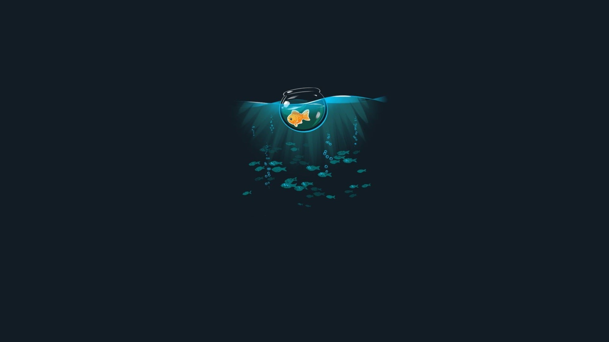

# Olá 👋,  Eu sou o Isaias!
# Seja bem vindo(a) ao meu GitHub!

- 🎓 Estudante de Análise e Desenvolvimento de Sistema.
- ❤ Tecnologia, Games, Anime, filmes, Basquete.
- 👨‍💻 Objetivo FullStack.

  
  
  

  
  
  
  
  
  
  
  
  
  
  
  
  

